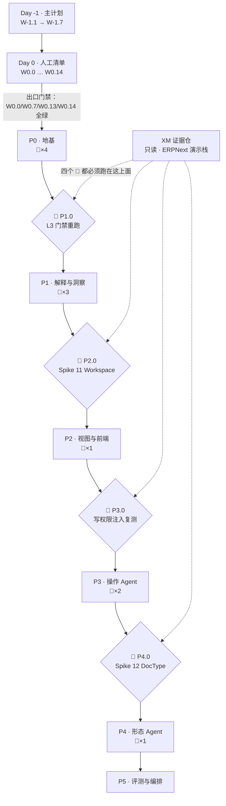

# 02 · 全量 WBS

> **表规（违反即不许进表）**
> 1. 每一行必须绑定**验收**：一条可跑的命令，或一个红测试文件路径。写「完成后确认无误」这类话的行，直接删掉。
> 2. 每一行必须有**状态源**：`LX:<todo>`（LoopX todo）｜ `MD:<mission>`（mission-driver plan）｜ `CI:<job>` ｜ `人`。**状态源为空不许进表。**
> 3. 一个工作项 = **1–2 个 plan**（方案 C §2.3 的粒度约定，超过就拆行）。
> 4. 状态只有四种：`todo` / `doing` / `done` / `blocked`。**只有验收命令退 0 才能写 `done`**，写 `done` 的同一时刻必须往 [STATE.md](./STATE.md) §2 追加证据行。
> 5. 阶段验收判据**不复制到本表**——本表只写「跑什么命令」，判据正文在路线图（见 [README.md](./README.md) §5 引用登记表）。
> 6. **P1 及以后各行的验收命令是「占位形状」，不是承诺存在的命令。** 那些路径与包名此刻尚不存在，会在该工作项过 CP2（工作项→规格）时定稿。
>    **可改的是字符串，不可改的是形状**：必须仍是一条能跑、能给出退出码的命令或一个具体的测试文件路径。改成「人工确认」「目测无误」这类说法，等于把这一行从表里删掉。每次定稿在 STATE §2 记一条证据行。
>    Day -1 与 Day 0 各行不适用本条——那些命令**现在就能跑**。

**图例**：🔴 = 先红着的门禁测试（方案 C §4.4 的 11 个，`REF:REDTESTS`）｜ 🚪 = 阶段入口关口实验（跑在 XM 证据栈上）

---

## 1. Day -1 · 主计划自身（在本仓完成）

| ID | 工作项 | 前置 | 验收 | 状态源 | 状态 |
|---|---|---|---|---|---|
| W-1.1 | 提交 XM 未提交的 81 行 diff，冻结为只读证据仓 | — | `git -C $XM_PATH log -1 --format=%H` == `evidence-repo.env` 的 `XM_SHA` | 人 | done |
| W-1.2 | 新仓 `git init` + `docs/masterplan/` 九件套落盘 | W-1.1 | `ls docs/masterplan/*.md \| wc -l` == 8 且每份 `wc -c` < 30720 | 人 | doing |
| W-1.3 | 外部件安装（LoopX / 技能），**尽力而为，失败不阻塞** | — | 每项装机结果（成功／失败＋替代方案生效）在 STATE §2 各有一条证据行 | 人 | doing |
| W-1.4 | 质询关 CP1：拷问整套主计划并按结果修订 | W-1.2 | [03-SKILL-GATE-MAP.md](./03-SKILL-GATE-MAP.md) §A1 十问逐条有书面回答 | 人 | **done** |
| W-1.5 | 交付物四测 T1–T4 | W-1.2 | 见 [README.md](./README.md) §8，四条全过 | 人 | **done** · T1/T2/T3/T4 全过（2026-08-20，证据见 STATE §2）；三条修订已回填 |
| W-1.6 | `plan.html` + 发布 Artifact | W-1.2 | 页面可打开，阶段阶梯/关口图/技能矩阵/速查卡齐全 | 人 | **done** · 已发布：<https://claude.ai/code/artifact/88e80606-2137-4df4-923b-94ccdf5dff3b>（重启桌面端解除 `essential-traffic-only` 后补发）；甘特改为阶段阶梯——无真实日期，画甘特等于造数 |
| W-1.7 | 提交 + 打 tag `masterplan-v1` | W-1.6 | `git tag -l masterplan-v1` 非空 | 人 | **done** |

---

## 2. Day 0 · 人工清单（1–2 天，不可外包）

方案 C §6 的十项（`REF:DAY0`）+ 本主计划新增的五项。**这些是心因子本身，必须由人做或人逐字审。**

| ID | 工作项 | 前置 | 验收 | 状态源 | 来源 |
|---|---|---|---|---|---|
| **W0.0** | **计费口径核实 + 成本基线**：确认 loop 驱动走的是订阅还是 API；实测一个最小 mission 的真实 token / 墙钟消耗 | W-1.7 | 一条 STATE 证据行，含：驱动方式、单 plan 平均 token、据此定出的**单 mission 成本阈值数字**（写进停机条件） | 人 | **新增（D-3 前提）** |
| **W0.0b** ✅ | **打通订阅路径**（**已完成 2026-08-20**：新起会话已走订阅；当前桌面进程环境仍为旧值，需重启）：当前 `~/.claude/settings.json` 把 `ANTHROPIC_BASE_URL` 指向本地代理、模型全设为 `deepseek.local`，headless `claude -p` 与子代理**均起不来**。loop 会继承同一份配置 | W0.0 | `claude -p "ping"` 退 0 且返回非空；`env \| grep ANTHROPIC` 的取值与所选驱动一致 | 人 | **新增（2026-08-20 实测）** |
| W0.1 | 拍定项目名：复核 GitHub org / PyPI / 域名可得性 | — | 三项复核各留一条证据行；结论写回 [DECISIONS.md](./DECISIONS.md) D-1 | 人 | **done** 2026-08-20T14:43Z · 三项均复核，D-1 维持 |
| W0.2 | 建仓库骨架：`install-age.sh` 安装 AGE 骨架 | W0.1 | `ls docs/{architecture,design,backlog,context,testing,archive,plans}` 全部存在 | 人 | **done** 2026-08-20T14:45Z · 88 文件，七目录齐全；`.env` 的 MISSION_DRIVER_HOME 待 W0.8 修正 |
| W0.3 | 拆分 `ARCHITECTURE.md`（69KB/1159 行）→ `docs/architecture/` + `docs/design/` | W0.2 | `find docs -name '*.md' -size +30k` 输出为空 | 人 | **done** 2026-08-20T14:48Z · 拆 8 份，零行遗失；REF 表 6 条 M 行已重指向，T2 复跑 exit 0 |
| W0.4 | 迁入并改写 ROADMAP → `docs/backlog/implementation-roadmap.md`：原则 4 换成 mission、P0 交付表那一格换成「AGE 骨架安装 + mission 配置」 | W0.2 | ① `grep -c OpenSpec` == 0；② **引擎自己的解析器**读得出 6 个阶段（`parseRoadmapMarkdown` / `roadmap-check.mjs`） | 人 | **done** 2026-08-20T14:51Z · 两条判据均实测通过 |
| W0.5 | 写 `AGENTS.md`，含红线「loop 不得修改 `tests/gates/`」 | W0.2 | `grep -q 'tests/gates' AGENTS.md` | 人 | **done** 2026-08-20T14:52Z · 红线 7 条 + 裁判规则 5 条，置于文件最前并声明优先级 |
| W0.6 | 手写 P0 的 4 个红测试🔴 | W0.2 | `pytest tests/gates -q` **全红**（这一步的正确结果是失败） | 人 | §6-6 |
| W0.7 | 配 GitHub Actions CI（最终裁判） | W0.6 | 一次 push 触发 CI，结果可见 | `CI:gates` | §6-7 |
| W0.8 | fork mission-driver，打 P1/P2/P3 三个补丁；同步提上游 PR | — | `node tools/mission-driver/src/engine.js --help` 可跑；`GATE_VERIFY` 出现在 `flows/plan-execution.json` | 人 | §6-8 |
| **W0.8b** | 实现 `--driver claude`（含 HOME/cwd 沙箱，见 [01](./01-EXECUTION-MODEL.md) §5） | W0.8, W0.0 | 一次 `--driver claude` 干跑产出非空回复，且**上下文里不含本仓 CLAUDE.md / skills**（token 数与空目录基线相差 < 5%） | 人 | **新增（D-3）** |
| W0.9 | 写 `missions/p0-foundation.json` **+ `docs/backlog/p0-foundation-roadmap.md`**（引擎回写的那份） | W0.4, W0.8 | `node ... --mission missions/p0-foundation.json --dry-run` 退 0；`goal` 字段含北极星原文；`roadmapPath` 指向 P0 自己的 roadmap **而非全局索引** | 人 | §6-9 |
| W0.10 | 重写 `prompts/build-verify.md`（去 Maven/Jira 特化，改 Python/Frappe 语境） | W0.8 | `grep -ciE 'maven\|jira\|-pl ' prompts/build-verify.md` == 0 | 人 | §6-10 |
| W0.11 | 装技能（mattpocock / grill-me / tospec），**尽力而为** | — | 每项一条证据行；装不上则标注「走 03 §A_n 内置清单」 | 人 | **done** · 目录中不存在（搜索返回空结果），走 03 内置等效清单，不再重试 |
| **W0.12** | LoopX 集成，**2 小时硬上限** | W-1.3 | 闭环跑通：建 goal → 建 todo → `loopx quota should-run` 给出决策 → 门禁退出码由脚本写回证据。**超时未通即按 D-6 退回 STATE.md 手工纪律** | 人 | **新增（D-6）** |
| **W0.13** | **锚点重映射 + T2 复跑**（W0.3/W0.4 会把主计划的引用全部打断） | W0.3, W0.4 | 改 [README.md](./README.md) §5 引用登记表后 `tools/check-masterplan-links.sh` 退 0 | 人 | **新增（本主计划）** |
| **W0.14** | 空转一次 mission（不产出业务代码，只验证循环与门禁联动） | W0.9, W0.8b, W0.13 | 人为让 `pytest` 失败 → `GATE_VERIFY` 判 fail → 循环 retry；人为改 `tests/gates/**` → **立即停机** | 人 | **新增（本主计划）** |

**Day 0 出口门禁**：W0.0、W0.7、W0.13、W0.14 四项全绿，才允许 `./mission-driver.sh p0-foundation` 接管。少一项都不许开 7×24。

---

## 3. P0 · 地基（无 Agent） → `REF:ROADMAP-P0`

| ID | 工作项 | 前置 | 验收 | 状态源 |
|---|---|---|---|---|
| P0.1 | 零依赖启动（compose 语法修法） | Day 0 出口 | 🔴 `tests/gates/test_zero_dep_boot.py` | `MD:p0-foundation` |
| P0.2 | 工具契约层 v0：契约声明格式 + 10 个只读工具 | P0.1 | `pytest tests/contracts -q` 退 0（前置条件/后置断言可独立测试） | `MD:p0-foundation` |
| P0.3 | 状态快照与 diff（任意时刻快照 + 两快照 diff + 断言 DSL） | P0.2 | 🔴 `tests/gates/test_snapshot_diff_structured.py` | `MD:p0-foundation` |
| P0.4 | 定制包规范化器（剥离 `modified`/`creation`/`owner`/`_comments` 并稳定排序） | P0.3 | 🔴 `tests/gates/test_normalizer_idempotent.py` | `MD:p0-foundation` |
| P0.5 | 差集 apply 引擎（读包 → 求差 → **对差集执行删除**） | P0.4 | 🔴 `tests/gates/test_customization_roundtrip_delete.py` | `MD:p0-foundation` |
| P0.6 | 种子数据：确定性程序化生成，**内置已知业务荒谬**（1,010 米积压） | P0.3 | 同种子两次生成 `diff` 为空，且断言积压场景存在：`python -m agenerp.seed --seed 42 --verify` 退 0 | `MD:p0-foundation` |
| P0.7 | 零依赖启动 CI（空环境变量下 config + up + healthcheck） | P0.1, W0.7 | `CI:gates` 上 `test_zero_dep_boot` 绿 | `CI:gates` |
| P0.8 | **CP9 · P0 阶段复盘**：AGE 与 LoopX 是否续用（判据见 [04](./04-RUNBOOK.md) §7） | P0.1–P0.7 | 复盘纪要落 `docs/audits/`，两项各有明确「续用/停用」结论 | 人 |

---

## 4. P1 · 解释与洞察（②端只读） → `REF:ROADMAP-P1`

| ID | 工作项 | 前置 | 验收 | 状态源 |
|---|---|---|---|---|
| **P1.0** 🚪 | **入口关口实验**：重跑 L3 门禁（两跳传递闭包），补齐「门禁能否补偿模型能力」承重命题里本轮未跑完的部分 | P0.8 | 在 XM 证据栈跑：`cd $XM_PATH/spike/02-constrained-agent && python3 run.py --model ollama:qwen3:14b --probe p1_correctness --gate 3`；**结论无论正反都写进 STATE §2 与 `docs/archive/`**。⚠️ 不得据此声称门禁可替代模型能力（`REF:PBV-RESIDUAL`） | 人 |
| P1.1 | 模型路由 v0：OpenAI-compatible adapter + **能力声明按任务分档** | P1.0 | `pytest tests/routing -q` 退 0；分档表落 `docs/architecture/` | `MD:p1-explain` |
| P1.2 | 上下文层 v0：即时上下文注入 + 会话落 DocType | P1.1 | `pytest tests/context -q` 退 0 | `MD:p1-explain` |
| P1.3 | 结构化导航工具（`system.overview`/`permission.scope`/`meta.fields`/`doc.links`），**`permission.scope` 由循环开场自动注入** | P1.2 | `pytest tests/tools/test_navigation.py -q` 退 0，且断言开场注入发生 | `MD:p1-explain` |
| P1.4 | 解释 Agent + **证据充分性门禁** | P1.3 | 🔴 `tests/gates/test_evidence_gate_blocks_single_hop.py` | `MD:p1-explain` |
| P1.5 | 洞察 Agent：**按行业包规则清单**巡检 | P1.4 | 🔴 `tests/gates/test_insight_rule_ablation.py` | `MD:p1-explain` |
| P1.6 | 行业包 v0（离散制造）：业务合理性规则为首要内容，**每条带 `test_case`** | P1.5 | `python -m agenerp.packs validate --pack discrete` 退 0（无 `test_case` 的规则即失败） | `MD:p1-explain` |
| P1.7 | 单次解释成本上限 | P1.4 | 🔴 `tests/gates/test_explain_cost_ceiling.py` | `MD:p1-explain` |
| P1.8 | Agent 侧边栏嵌 Desk（⌘K 唤起，保留当前单据上下文） | P1.4 | `pytest -m live tests/ui/test_sidebar.py` 退 0 | `MD:p1-explain` |
| P1.9 | CP9 · P1 阶段复盘 | P1.1–P1.8 | 纪要落 `docs/audits/` | 人 |

---

## 5. P2 · 视图生成与新前端 → `REF:ROADMAP-P2`

| ID | 工作项 | 前置 | 验收 | 状态源 |
|---|---|---|---|---|
| **P2.0** 🚪 | **入口关口实验：Spike 11 · Workspace 升级覆盖**（判据见 `REF:ROADMAP-SPIKE1112`） | P1.9 | 在 XM 演示栈上跑完四步，结论决定「视图产物落 Workspace 还是落 AgenERP 自有表」，写进 `docs/architecture/` | 人 |
| P2.1 | 视图 DSL v0（`list`/`detail`/`metric`/`chart`/`explain` 五种块） | P2.0 | `pytest tests/dsl -q` 退 0 | `MD:p2-views` |
| P2.2 | 渲染器（frappe-ui）：**未支持的一律落回 Desk** | P2.1 | `pytest -m live tests/render -q` 退 0 | `MD:p2-views` |
| P2.3 | 视图 Agent：自然语言 → DSL（含 `dsl.validate`/`dsl.preview`） | P2.2 | `pytest tests/agents/test_view_agent.py -q` 退 0 | `MD:p2-views` |
| P2.4 | 定制包 GitOps v0（依赖 P0.4 / P0.5） | P2.3 | `scripts/verify-gitops.sh` 退 0：改 → diff → revert → 迁站点四步 | `MD:p2-views` |
| P2.5 | `schema.drift` 巡检（检出孤儿列） | P2.4 | `pytest tests/tools/test_schema_drift.py -q` 退 0 | `MD:p2-views` |
| P2.6 | 角色首页（②③端按角色渲染） | P2.2 | 🔴 `tests/gates/test_no_empty_workspace.py` | `MD:p2-views` |
| P2.7 | 术语层（LLM 生成 label，绕开社区翻译） | P2.2 | `pytest tests/i18n -q` 退 0 | `MD:p2-views` |
| P2.8 | CP9 · P2 阶段复盘 | P2.1–P2.7 | 纪要落 `docs/audits/` | 人 |

---

## 6. P3 · 操作 Agent（③端写入） → `REF:ROADMAP-P3`

| ID | 工作项 | 前置 | 验收 | 状态源 |
|---|---|---|---|---|
| **P3.0** 🚪 | **入口关口实验：写权限下的注入复测**（现有抗注入结论只覆盖 L0 只读），并扩测 Memory 投毒 | P2.8 | 在 XM 演示栈复跑 `spike/04-injection` 载荷，**这次给写工具**；四类载荷 0 执行，结论落 `docs/archive/` | 人 |
| P3.1 | 工具契约层 v1：写契约（前置条件 + 后置断言 + 回滚语义 = savepoint 回滚） | P3.0 | `pytest tests/contracts/test_write_contract.py -q` 退 0 | `MD:p3-ops` |
| P3.2 | 回滚前提回归测试 | P3.1 | 🔴 `tests/gates/test_no_commit_in_submit_path.py` | `MD:p3-ops` |
| P3.3 | 操作 Agent（建单、提交、报工、走流程） | P3.2 | `pytest -m live tests/agents/test_ops_agent.py` 退 0（不绕过 4 道 `before_submit`） | `MD:p3-ops` |
| P3.4 | 风险分级与审批 harness（**审批 gate 长在控制循环里**，不是外挂） | P3.3 | `pytest tests/approval -q` 退 0；越权/超阈值被拦截并要求人批 | `MD:p3-ops` |
| P3.5 | 补偿事务（后置断言不成立时回滚与留痕） | P3.3 | 🔴 `tests/gates/test_rollback_clean.py` | `MD:p3-ops` |
| P3.6 | Memory v0（三层粒度 DocType + 分级 + 安全红线） | P3.4 | `pytest tests/memory -q` 退 0，含投毒用例 | `MD:p3-ops` |
| P3.7 | Harness 采用决策（依实测 worker 开销与镜像体积） | P3.3 | 决策记录进 [DECISIONS.md](./DECISIONS.md)，附实测数字 | 人 |
| P3.8 | CP9 · P3 阶段复盘 | P3.1–P3.7 | 纪要落 `docs/audits/` | 人 |

---

## 7. P4 · 形态 Agent（①端） → `REF:ROADMAP-P4`

| ID | 工作项 | 前置 | 验收 | 状态源 |
|---|---|---|---|---|
| **P4.0** 🚪 | **入口关口实验：Spike 12 · custom DocType 全生命周期**（建→导出→diff→删） | P3.8 | 四步全程可治理即通过；任一环节做不到即失败（已知风险：`developer_mode` 关闭时 `export_customizations` 不可用）。结论决定 P4 能否触及 DocType 层 | 人 |
| P4.1 | 形态 Agent（Custom Field / DocType / Property Setter / 权限） | P4.0 | `pytest -m live tests/agents/test_shape_agent.py` 退 0 | `MD:p4-shape` |
| P4.2 | 冗余判断（原生字段冲突检查） | P4.1 | `pytest tests/tools/test_conflict_check.py -q` 退 0 | `MD:p4-shape` |
| P4.3 | 权限五层联动（DocType / **Report.Has Role** / Workspace 可见性 / Workspace 内容 / 渲染 API） | P4.1 | 🔴 `tests/gates/test_five_layer_permission.py` | `MD:p4-shape` |
| P4.4 | 定制包 GitOps v1（元数据变更 diff、迁移计划、回滚） | P4.1 | `scripts/verify-gitops.sh --meta` 退 0 | `MD:p4-shape` |
| P4.5 | L3 审批链（强制人批 + 落 git；**Server Script 永不运行时注入**） | P4.4 | `pytest tests/approval/test_l3_chain.py -q` 退 0；`grep -r 'Server Script' src/` 无运行期生成路径 | `MD:p4-shape` |
| P4.6 | CP9 · P4 阶段复盘 | P4.1–P4.5 | 纪要落 `docs/audits/` | 人 |

---

## 8. P5 · 评测与编排 → `REF:ROADMAP-P5`

| ID | 工作项 | 前置 | 验收 | 状态源 |
|---|---|---|---|---|
| P5.1 | 评测集：state-diff 判定 + 业务合理性规则；**补齐重复实验与统计显著性**（本轮所有探针每题各跑 1 次） | P4.6 | `python -m agenerp.bench run --repeat 5` 产出带方差的报告；1,010 米积压为 test case #1 | `MD:p5-eval` |
| P5.2 | 持续基准生成（随 DocType 演进自动更新） | P5.1 | `python -m agenerp.bench regen --check` 退 0 | `MD:p5-eval` |
| P5.3 | 编排 Agent（意图路由、任务分解、跨 Agent 调度） | P5.1 | `pytest tests/agents/test_orchestrator.py -q` 退 0 | `MD:p5-eval` |
| P5.4 | 行业包机制 v1（声明格式与分发） | P5.1 | 新增一个行业包**不改内核**即可加载：`python -m agenerp.packs add --from examples/pack-demo` 退 0 | `MD:p5-eval` |
| P5.5 | 结项复盘：对照 [00-GOALS.md](./00-GOALS.md) §2 逐条核 S1–S6 | P5.1–P5.4 | 六条各有一条命令 + 退出码证据行 | 人 |

---

## 9. 阻塞关系

**四个 🚪 是 XM 必须伴随存在的硬理由**：它们要跑在真实 ERPNext v16 演示栈上（816 DocType / 完整业务链），新仓在 P2 之前没有等价环境。对应行的前置条件里已写死这一点。
